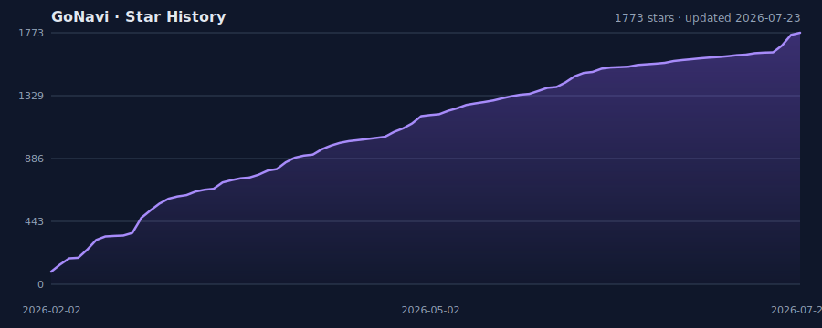

<p align="center">
  
</p>

<h1 align="center">GoNavi</h1>

<p align="center">
  <b>一套客户端，航行全部数据源 — 原生性能 · Agent 就绪 · 告别 Electron 膨胀。</b>
</p>

<p align="center">
  基于 <a href="https://wails.io">Wails</a>（Go）+ <a href="https://react.dev">React</a> 的跨平台数据库工作台。
  桌面优先，MCP 原生，二进制约 <b>30MB</b> 量级。
</p>

<p align="center">
  <a href="https://github.com/Syngnat/GoNavi/releases"></a>
  <a href="https://github.com/Syngnat/GoNavi/releases"></a>
  <a href="https://github.com/Syngnat/GoNavi/stargazers"></a>
  <a href="LICENSE"></a>
</p>

<p align="center">
  <a href="https://go.dev"></a>
  <a href="https://wails.io"></a>
  <a href="https://reactjs.org"></a>
  <a href="https://github.com/Syngnat/GoNavi/actions"></a>
</p>

<p align="center">
  <b>语言</b>：<a href="README.md">English</a> · 简体中文
  &nbsp;·&nbsp;
  <a href="https://github.com/Syngnat/GoNavi/releases"><b>⬇ 下载</b></a>
  ·
  <a href="#-快速开始"><b>⚡ 快速开始</b></a>
  ·
  <a href="#-核心能力"><b>✨ 特性</b></a>
  ·
  <a href="#-mcp--agents"><b>🤖 MCP</b></a>
</p>

<p align="center">
  <sub>赞助商 ·
  <a href="#-赞助商"><b>华龙中转站</b></a></sub>
</p>

---

## 为什么是 GoNavi？

市面上大量数据库 GUI 仍是 Electron 壳：体积大、启动慢、内存高。GoNavi 换了一条路：

| | 常见 Electron 客户端 | **GoNavi** |
|---|---|---|
| 运行时 | Chromium + Node | **Go + 系统 WebView** |
| 体积 | 动辄数百 MB | **约 30MB 量级** |
| 启动 | 偏重 | **更快** |
| 内存 | 基线高 | **更轻** |
| AI / Agent | 外挂或缺失 | **MCP + 多模型一等公民** |
| 数据源 | 以 RDBMS 为主 | **SQL · 缓存 · 向量 · 消息 · 搜索 · 时序 · 国产库** |

> **MySQL、Postgres、Redis、Kafka、Milvus、OceanBase、ClickHouse… 一个工作台打通。**  
> 查询、编辑、审计、同步；把结构化上下文交给编码 Agent，密码仍留在本机。

---

## 一眼看懂

```text
┌──────────────────────────────────────────────────────────────────────┐
│  GoNavi 工作台                                                       │
│  ┌─────────────┐  ┌──────────────────┐  ┌─────────────────────────┐  │
│  │ 连接管理    │  │ Monaco SQL + AI  │  │ 虚拟滚动 DataGrid       │  │
│  │ SSH / 代理  │  │ 表结构上下文     │  │ 批量编辑 · 导出         │  │
│  │ 驱动代理    │  │ 快捷指令         │  │ 事务提交 / 回滚         │  │
│  └─────────────┘  └────────┬─────────┘  └─────────────────────────┘  │
│                            │                                         │
│              ┌─────────────▼─────────────┐                           │
│              │  Go 核心 · 审计 · 同步    │                           │
│              │  MCP HTTP · Web Server    │                           │
│              └───────────────────────────┘                           │
└──────────────────────────────────────────────────────────────────────┘
```

### 产品截图

每张均为 **完整 GoNavi 应用窗口**，再通过 README 宽度控件等比例缩小展示。

<p align="center">
  
  &nbsp;
  
</p>

<p align="center">
  
</p>

<p align="center"><sub>真实桌面全窗口截图</sub></p>

---

## ✨ 核心能力

<table>
<tr>
<td width="50%" valign="top">

### 🤖 懂表结构的 AI
- OpenAI · Gemini · Claude · 自定义 OpenAI 兼容 API  
- 将当前库表结构注入对话上下文  
- 快捷指令：生成 SQL、解释、优化、表设计评审  
- **MCP**：一键装到 Claude Code / Codex，或 Streamable HTTP 给远端 Agent  
- 连接与密码留在运行 GoNavi 的主机上  

</td>
<td width="50%" valign="top">

### ⚡ 大数据仍流畅
- 虚拟滚动 DataGrid，扛住大结果集  
- 单元格编辑 · 批量增删改 · 事务提交/回滚  
- 大字段弹窗 · 按查询智能切换读写  
- 导出：CSV · XLSX · JSON · Markdown  
- Monaco + 库/表/字段上下文补全  

</td>
</tr>
<tr>
<td width="50%" valign="top">

### 🔌 连接与驱动
- URI 生成 / 解析  
- SSH 隧道 · 代理  
- 连接配置 JSON 导入导出  
- 可选驱动代理按需安装  
- Custom Driver + DSN 扩展  

</td>
<td width="50%" valign="top">

### 🛡️ 可观测 & 可交付
- SQL 执行日志（含耗时）  
- 审计中心（默认脱敏、保留策略、导出）  
- 桌面端 + 实验性 **Web Server**  
- Docker / K8s / Helm / Podman  
- 更新检查 · 多架构发布  

</td>
</tr>
</table>

### 🧩 技术栈

`Go 1.24` · `Wails v2` · `React 18` · `TypeScript` · `Vite` · `Ant Design 5` · `Zustand` · `Monaco`

---

## 🗄 支持的数据源

> **内置**：开箱即用 · **可选驱动代理**：在驱动管理中安装启用

| | |
|---|---|
| **内置** | MySQL · GoldenDB · PostgreSQL · Oracle · Redis · Chroma · Qdrant · Milvus · RocketMQ · MQTT · Kafka · RabbitMQ |
| **可选** | MariaDB · Doris · StarRocks · Sphinx · SQL Server · SQLite · DuckDB · OceanBase · 达梦 · 人大金仓 · 瀚高 · 海量 · openGauss · GaussDB · IRIS · MongoDB · TDengine · IoTDB · ClickHouse · Trino · Elasticsearch · Custom Driver/DSN |

<details>
<summary><b>完整能力矩阵</b></summary>

| 类别 | 数据源 | 驱动模式 | 典型能力 |
|---|---|---|---|
| 关系型 | MySQL | 内置 | 库表浏览、SQL 查询、数据编辑、导出/备份 |
| 国产数据库 | GoldenDB | 内置 | MySQL 兼容查询工作流、分布式事务场景 |
| 关系型 | PostgreSQL | 内置 | 库表浏览、SQL 查询、数据编辑、对象管理 |
| 关系型 | Oracle | 内置 | 连接查询、对象浏览、数据编辑 |
| 缓存 | Redis | 内置 | Key 浏览、命令执行、编码/视图切换 |
| 向量数据库 | Chroma | 内置 | Collection 浏览、向量检索、元数据过滤 |
| 向量数据库 | Qdrant | 内置 | Collection 浏览、向量搜索、Payload 过滤 |
| 向量数据库 | Milvus | 内置 | Collection 浏览、向量搜索、标量过滤 |
| 消息队列 | RocketMQ | 内置 | Topic 浏览、消费组检查、消息型工作流 |
| 消息队列 | MQTT | 内置 | Broker / Topic Filter 工作流与 QoS 连接配置 |
| 消息队列 | Kafka | 内置 | Topic 浏览、Broker 元数据、消费组工作流 |
| 消息队列 | RabbitMQ | 内置 | Queue / Exchange 浏览、Virtual Host 检查、Management API 工作流 |
| 关系型 | MariaDB | 可选驱动代理 | 连接查询、对象管理、数据编辑 |
| 关系型 | Doris | 可选驱动代理 | 连接查询、对象浏览、SQL 执行 |
| 列式分析 | StarRocks | 可选驱动代理 | 连接查询、对象浏览、SQL 执行 |
| 搜索 | Sphinx | 可选驱动代理 | SphinxQL 查询与对象浏览 |
| 关系型 | SQL Server | 可选驱动代理 | 库表浏览、SQL 查询、对象管理 |
| 文件型 | SQLite | 可选驱动代理 | 本地文件库浏览、编辑、导出 |
| 文件型 | DuckDB | 可选驱动代理 | 大表查询、分页浏览、文件库管理 |
| 国产数据库 | OceanBase | 可选驱动代理 | MySQL / Oracle 租户接入、对象浏览、查询工作流 |
| 国产数据库 | Dameng | 可选驱动代理 | 连接查询、对象浏览、数据编辑 |
| 国产数据库 | Kingbase | 可选驱动代理 | 连接查询、对象浏览、数据编辑 |
| 国产数据库 | HighGo | 可选驱动代理 | 连接查询、对象浏览、数据编辑 |
| 国产数据库 | Vastbase | 可选驱动代理 | 连接查询、对象浏览、数据编辑 |
| 国产数据库 | OpenGauss | 可选驱动代理 | 类 PostgreSQL 的库表浏览、SQL 查询、对象管理 |
| 国产数据库 | GaussDB | 可选驱动代理 | 类 PostgreSQL 的库表浏览、SQL 查询、对象管理 |
| 多模型数据库 | InterSystems IRIS | 可选驱动代理 | Namespace 浏览、SQL 查询、对象管理 |
| 文档型 | MongoDB | 可选驱动代理 | 文档查询、集合浏览、连接管理 |
| 时序 | TDengine | 可选驱动代理 | 时序库表浏览、查询分析 |
| 时序 | Apache IoTDB | 可选驱动代理 | Storage Group / Device / Timeseries 浏览与查询 |
| 列式分析 | ClickHouse | 可选驱动代理 | 分析查询、对象浏览、SQL 执行 |
| 联邦查询 | Trino | 可选驱动代理 | 跨多数据源联邦 SQL、`catalog.schema` 浏览、SQL 执行 |
| 搜索 | Elasticsearch | 可选驱动代理 | 索引浏览、Mapping 检查、JSON DSL / query_string 查询 |
| 扩展接入 | Custom Driver/DSN | 自定义 | 通过 Driver + DSN 接入更多数据源 |

</details>

---

## 🚀 快速开始

### 前置要求

- [Go](https://go.dev/dl/) 1.21+
- [Node.js](https://nodejs.org/) 18+
- [Wails CLI](https://wails.io/docs/gettingstarted/installation)

```bash
go install github.com/wailsapp/wails/v2/cmd/wails@v2.11.0
```

### 开发

```bash
git clone https://github.com/Syngnat/GoNavi.git
cd GoNavi

wails dev                          # 完整热重载
node tools/wails-fast-dev.mjs      # Go 导出签名未变时更快
node tools/wails-fast-dev.mjs --refresh-bindings  # 修改导出方法签名后刷新绑定
```

### 构建

```bash
wails build
wails build -clean   # 发布前推荐
```

产物位于 `build/bin`。

### 只想直接用？

前往 **[Releases](https://github.com/Syngnat/GoNavi/releases)** 下载  
（macOS AMD64/ARM64 · Windows AMD64 · Linux WebKitGTK 4.0/4.1）。

---

## 🌐 Web Server（实验中）

同一套 Go 后端 + React 前端提供浏览器访问（**不是**把 Wails 桌面窗口容器化）。

```powershell
go build .
.\GoNavi-Wails.exe web-server --addr 127.0.0.1:34116
```

- 首次访问进入 `/setup`（管理员密码；可选 Google Authenticator）
- 桥接：`window.go.*` / `window.runtime.*` → HTTP / SSE
- Session、恢复码、登录限流

#### Docker / Podman

```bash
cp docker.web-server.env.example docker.web-server.env
# 设置 GONAVI_HOST_DATA_ROOT 为绝对路径
# 可选：GONAVI_WEB_PASSWORD（至少 6 位）
docker compose --env-file docker.web-server.env -f docker-compose.web-server.yml up -d
```

打开 `http://127.0.0.1:34116`。将活动数据目录挂载到 `/data`  
（`connections.json`、`daily_secrets.json`，可选 `drivers/`）。  
认证状态写入 `web_auth.json`。

> **不要把未加固的 Web 入口直接暴露到公网。** 生产环境请配合反向代理与 HTTPS。

健康检查：`GET /__gonavi/healthz`  
本地源码构建：叠加 `-f docker-compose.web-server.local.yml --build`。

修改 env 密码后需重建容器：

```bash
docker compose --env-file docker.web-server.env -f docker-compose.web-server.yml up -d --force-recreate
```

（`docker restart` **不会**重新加载 env 文件。）

---

## 🤖 MCP & Agents

把结构工具交给 Agent，而不是把密钥交出去：

```bash
cp docker.mcp-server.env.example docker.mcp-server.env
docker compose --env-file docker.mcp-server.env -f docker-compose.mcp-server.yml up -d
```

| 形态 | 入口 |
|---|---|
| MCP 容器 | `docker-compose.mcp-server.yml` → `ghcr.io/syngnat/gonavi-mcp-server` |
| Web UI 容器 | `docker-compose.web-server.yml` → `ghcr.io/syngnat/gonavi-web-server` |
| Podman / Quadlet | [deploy/podman/gonavi-mcp-server](deploy/podman/gonavi-mcp-server) |
| Kubernetes | [deploy/k8s/gonavi-mcp-server](deploy/k8s/gonavi-mcp-server) |
| Helm | [deploy/helm/gonavi-mcp-server](deploy/helm/gonavi-mcp-server) |
| 仅构建镜像 | `Dockerfile.build-env` → `ghcr.io/syngnat/gonavi-build-env` |

安全默认：远端 `schema-only` 不暴露 `execute_sql`；变更类 SQL 需显式 `allowMutating=true`。  
详见：[cmd/gonavi-mcp-server/README.md](cmd/gonavi-mcp-server/README.md)。

### 仅 Linux 构建环境

```bash
docker build -f Dockerfile.build-env -t gonavi-build-env:local .
docker run --rm -it -v "$PWD:/workspace" -w /workspace gonavi-build-env:local bash
```

---

## 📦 发布流水线

推送 `v*` Tag → GitHub Actions 自动多架构构建。  
Release 说明按 `.github/release.yaml` 从已合并 PR 生成。

---

## 🛠 常见问题

<details>
<summary><b>Windows：缺少 Microsoft Edge WebView2 运行时（内网常见）</b></summary>

GoNavi 桌面版在 Windows 上依赖 **Microsoft Edge WebView2 Runtime**（系统级组件，不是完整 Chrome）。  
部分内网 / 精简镜像 / Windows Server / LTSC 机器未预装，会出现：

- 双击后窗口一闪即关、白屏、空白窗口
- 提示找不到 WebView2 / WebView2 Runtime
- 杀软或组策略拦截了运行时安装

### 1. 先确认是否已安装

在 **PowerShell** 中执行：

```powershell
# Evergreen Runtime 常见安装目录（64 位系统）
Test-Path "${env:ProgramFiles(x86)}\Microsoft\EdgeWebView\Application"

# 注册表（有显示名称通常表示已安装）
Get-ItemProperty -Path "HKLM:\SOFTWARE\WOW6432Node\Microsoft\EdgeUpdate\Clients\{F3017226-FE2A-4295-8BDF-00C3A9A7E4C5}" `
  -ErrorAction SilentlyContinue |
  Select-Object pv, name
```

若路径不存在且注册表无 `pv` 版本号，需要安装运行时。

### 2. 有外网：在线安装（最简单）

1. 打开微软官方下载页：  
   [Microsoft Edge WebView2](https://developer.microsoft.com/microsoft-edge/webview2/)
2. 下载 **Evergreen Bootstrapper**（体积小，安装时联网拉完整运行时）
3. 右键「以管理员身份运行」安装完成后，**重新打开 GoNavi**

### 3. 内网 / 离线：独立安装包（推荐企业分发）

Bootstrapper 在完全断网环境会失败。请改用 **Evergreen Standalone Installer**：

1. 在一台能上网的电脑打开同一下载页，下载对应架构的独立安装包，例如：
   - `MicrosoftEdgeWebView2RuntimeInstallerX64.exe`（绝大多数 64 位 Windows）
   - `…X86.exe` / `…ARM64.exe`（按机器架构选择）
2. 将安装包拷贝到内网（U 盘、软件中心、文件共享均可）
3. 在目标机 **管理员权限** 安装：

```powershell
# 交互安装
.\MicrosoftEdgeWebView2RuntimeInstallerX64.exe

# 静默安装（便于 IT 批量推送）
.\MicrosoftEdgeWebView2RuntimeInstallerX64.exe /silent /install
```

4. 安装完成后重新启动 GoNavi。若仍异常，注销/重启一次 Windows 再试。

### 4. 组策略 / 权限受限时

- 需要本地管理员或由 IT 通过 SCCM / 软件中心推送 Standalone 安装包  
- 确认未禁用 Edge / WebView2 相关更新与安装策略  
- 企业可固定使用 [Fixed Version](https://developer.microsoft.com/microsoft-edge/webview2/) 运行时并由管理员统一维护（一般用户优先 Evergreen）

### 5. 临时绕过：Web Server 模式（仍需能跑 GoNavi 后端）

若桌面 WebView 短期无法装上，可在本机用浏览器访问实验性 Web Server（**不是**把桌面窗口容器化）：

```powershell
# 以发布包中的可执行文件为例
.\GoNavi.exe web-server --addr 127.0.0.1:34116
```

浏览器打开 `http://127.0.0.1:34116`。详见上文「Web Server」章节。  
注意：未加固的 Web 入口不要直接暴露到公网。

更多说明与反馈入口见 Issue：[#672](https://github.com/Syngnat/GoNavi/issues/672)。

</details>

<details>
<summary><b>macOS：提示「应用已损坏，无法打开」</b></summary>

未做 Apple Notarization 时，Gatekeeper 可能拦截：

```bash
sudo xattr -rd com.apple.quarantine /Applications/GoNavi.app
```

也可在 Finder 中右键打开。建议先移到「应用程序」。

</details>

<details>
<summary><b>Linux：缺少 WebKitGTK</b></summary>

```bash
# Debian 13 / Ubuntu 24.04+
sudo apt-get update
sudo apt-get install -y libgtk-3-0 libwebkit2gtk-4.1-0 libjavascriptcoregtk-4.1-0

# Ubuntu 22.04 / Debian 12
sudo apt-get update
sudo apt-get install -y libgtk-3-0 libwebkit2gtk-4.0-37 libjavascriptcoregtk-4.0-18
```

带 `-WebKit41` 后缀的产物更适配 Debian 13 / Ubuntu 24.04+。

</details>

<details>
<summary><b>Linux：中文显示为方框</b></summary>

```bash
sudo apt-get update
sudo apt-get install -y fonts-noto-cjk fonts-wqy-microhei
fc-cache -fv
```

</details>

---

## 💖 赞助商

<p align="center">
  <a href="https://api-fast.hualong.online/">
    
  </a>
</p>

<p align="center">
  <b><a href="https://api-fast.hualong.online/">华龙中转站 · Hualong Transfer Station</a></b><br/>
  <sub>AI API Gateway · 多模型统一接入 · 国内直连高速端点</sub>
</p>

特别感谢 **[华龙中转站](https://api-fast.hualong.online/)** 赞助 GoNavi 开源开发。

| | |
|---|---|
| **他们是谁** | **AI API 中转 / Gateway**：以 OpenAI 兼容接口统一多模型接入，帮你少踩「渠道碎片化 + 网络不稳定」的坑。 |
| **核心能力** | 多模型统一路由 · OpenAI 兼容 · **国内直连高速端点** · 适合个人开发者与开源项目快速接通 LLM |
| **为什么推荐** | GoNavi 自身是 AI / MCP 一等公民产品；稳定、好用的模型通道，是写代码、做 Agent、联调多 Provider 的基础设施。 |

**需要靠谱的 LLM 中转？**  
👉 [https://api-fast.hualong.online/](https://api-fast.hualong.online/) — 控制台、文档与国内高速端点。

> 华龙另向本仓库赞助了 **共享 500 亿（50B）token** 额度，供 GoNavi **共建者** 以 **API Key** 方式协作开发使用（非整库人均 50B）。申请与规则见共建入口：[Issue #671](https://github.com/Syngnat/GoNavi/issues/671)。

---

## 🤝 贡献

欢迎 Issue 与 PR。请从 **`dev`** 拉分支，并向 **`dev`** 提 PR。

- [CONTRIBUTING.zh-CN.md](CONTRIBUTING.zh-CN.md)
- 共建邀请（含赞助 token 池说明）：[Issue #671](https://github.com/Syngnat/GoNavi/issues/671)

---

## 💬 联系与反馈

| 渠道 | 说明 |
|---|---|
| **GitHub Issues** | Bug、功能建议、文档问题优先在此提交，便于跟踪与复现 |
| **微信** | `ygf1140302783`（备注「GoNavi」）— 可拉交流群，适合使用讨论与快速沟通 |

> 技术问题尽量附版本号、系统与复现步骤；内网 Windows 启动白屏/闪退见 [WebView2 说明](https://github.com/Syngnat/GoNavi/issues/672)。

---

## ⭐ Star History

<!-- star-history:start -->
<a href="https://www.star-history.com/#Syngnat/GoNavi&Date">
 <picture>
   <source media="(prefers-color-scheme: dark)" srcset="assets/star-history/star-history-dark.svg" />
   <source media="(prefers-color-scheme: light)" srcset="assets/star-history/star-history-light.svg" />
   
 </picture>
</a>
<!-- star-history:end -->

---

## 友情链接

- [华龙中转站](https://api-fast.hualong.online/) — AI API Gateway（GoNavi 赞助商）
- [linux.do](https://linux.do/)
- [AI全书](https://aibook.ren/)

## 开源协议

[Apache-2.0](LICENSE)

<p align="center">
  <sub>为泡在 SQL、表结构与 Agent 循环里的人而造。</sub>
</p>
